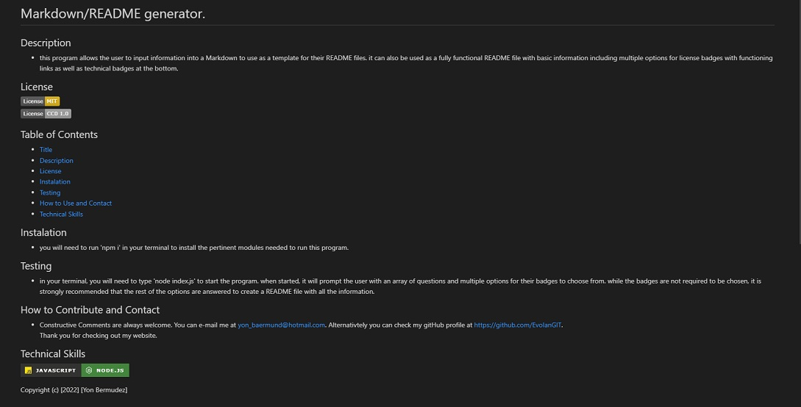

# Markdown/README generator.

## Description
  
- *THIS README WAS CREATED USING THE MARKDOWN GENERATED AS A TEMPLATE. THEN OTHER PARTS WERE INCLUDED SUCH AS THE LINK FOR THE VIDEO.*

- this program allows the user to input information into a Markdown to use as a template for their README files. it can also be used as a fully functional README file with basic information including multiple options for license badges with functioning links as well as technical badges at the bottom.

## License

  
    
  

## Table of Contents 

- [Title](#title)
- [Description](#description)
- [License](#license)
- [Visuals](#visuals)
- [Instalation](#instalation)
- [Testing](#test)
- [How to Use and Contact](#how-to-use)
- [Technical Skills](#technical-skills)

## Visuals 

## You can access the video showcase [**HERE**](https://www.youtube.com/watch?v=jSVA9eiz_Ew&t=16s)

---

---

## Instalation

- you will need to run 'npm i' in your terminal to install the pertinent modules needed to run this program.

## Testing

- in your terminal, you will need to type 'node index.js' to start the program. when started, it will prompt the user with an array of questions and multiple options for their badges to choose from. while the badges are not required to be chosen, it is strongly recommended that the rest of the options are answered to create a README file with all the information.

## How to Contribute and Contact

- Constructive Comments are always welcome. You can e-mail me at yon_baermund@hotmail.com. 
Alternativtely you can check my gitHub profile at https://github.com/EvolanGIT.  
Thank you for checking out my website.

## Technical Skills

Copyright (c) [2022] [Yon Bermudez]
